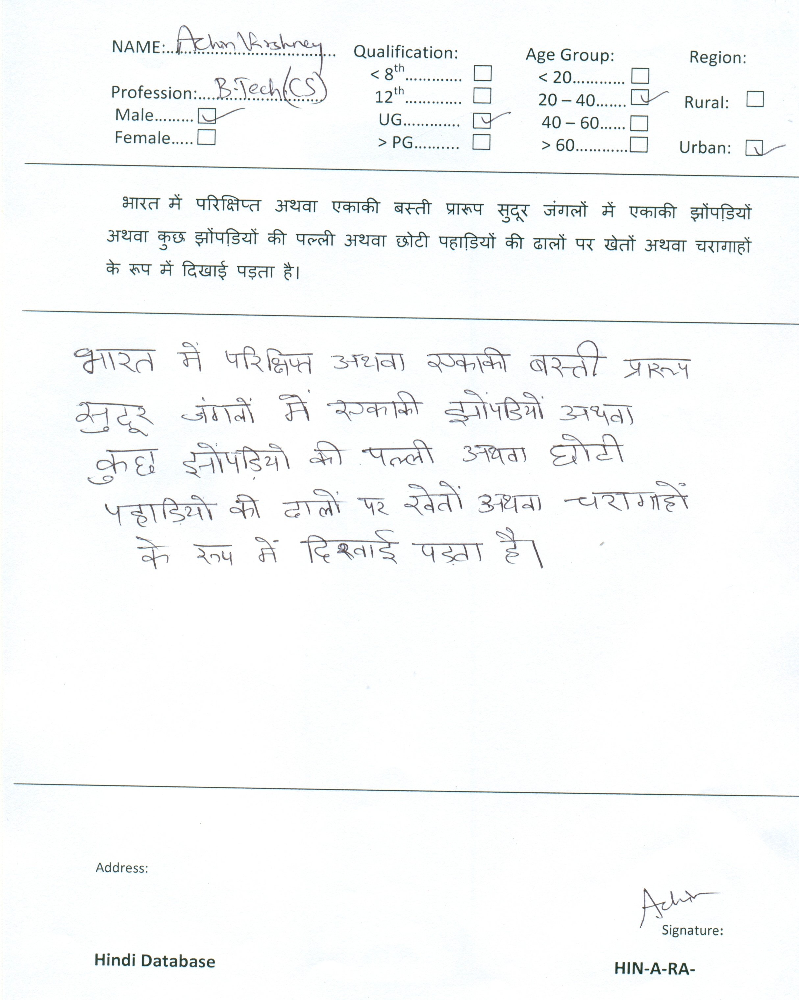
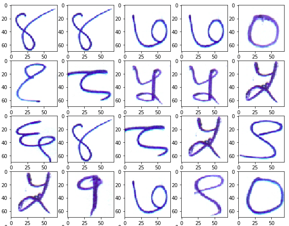
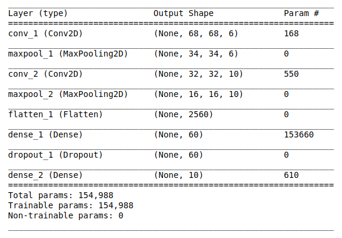
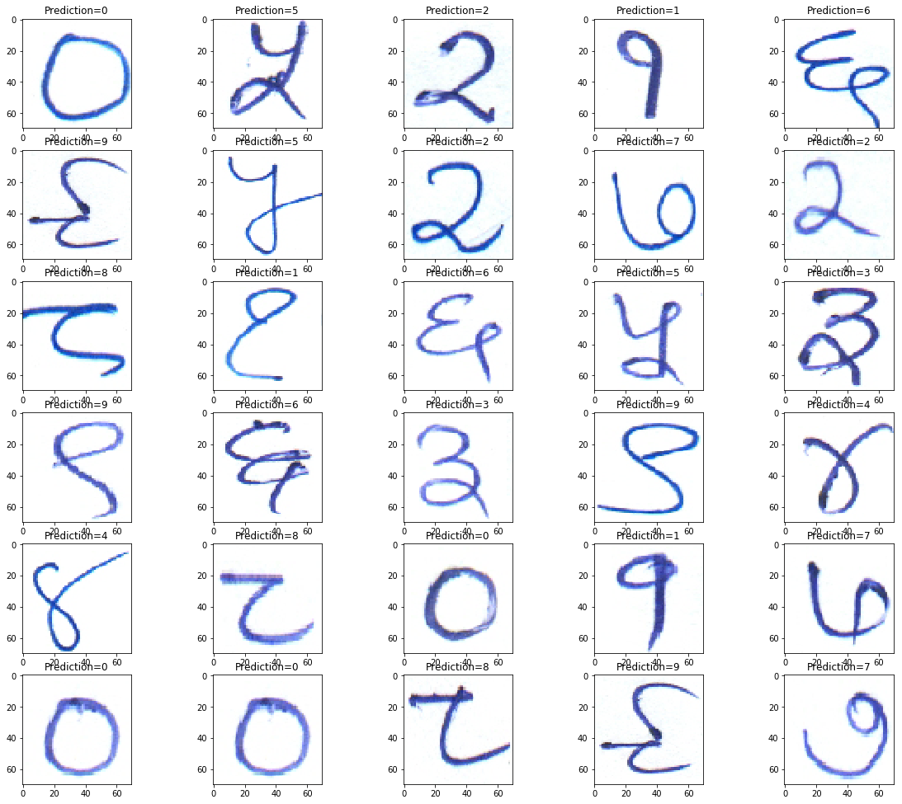
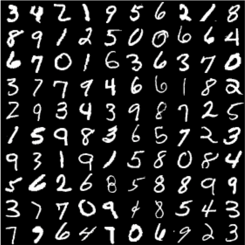
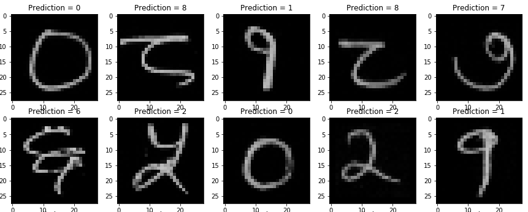

# Introduction
This project involves detection and recognition of handwritten text written in the Devanagari script suing Deep Learning techniques. It was taken up as a project work at Bhabha Atomic Research Center, India in the summer of 2019. Devanagari script is widely used in the Indian subcontinent. It is used for several major languages since ages like Sanskrit, Pali, Hindi, etc. This project deals with text in the Hindi language, to be precise. 

# Dataset
This project is based upon the dataset made available at the [International Conference on Computer Vision & Image Processing 2019](http://cvip2019.mnit.ac.in/) at Malaviya National Institute of Technology, Jaipur.
The dataset contains:
1. Hindi Numerals
2. Hindi Vowels
3. Hindi Consonants
4. Hindi Handwritten Text with seperate annotations for each of them.

Sample:

  

This dataset was divided into `train`, `test`, and `valid` approximately with 96%, 2%, 2% data from the entire dataset respectively.

## Limitations of the dataset
However, the dataset was essentially small with only 50 images of Handwritten Text. Therefore, difficulties were faced while training the model accurately.
Secondly, not all images were consistent and there was some noise in the data too.

# Components
The project can be divided into 3 major sections:
* **Classification of the Hindi numerals using CNN.**
* **Studying the effect of using Transfer Learning on the dataset for classification of numerals.**
* **Word and Line Segmentation using Image Processing Techniques.**

## Classification using CNN
Convolution Neural Networks have played a major role in the field of Computer Vision in the last few years. Here, one such CNN has been implemented to classify the numerals of the Devanagari script. The numerals of the Devanagari script looks like:

  

The CNN model used is rather a basic network to reduce overfitting (as already mentioned before the dataset is small). 

  

The model was trained with the `EarlyStopping` callback and it was observed that the accuracy on the validation dataset stagnates after 5 epochs where it stops further training to avoid overfitting. The outcomes and the code can be seen in the `devanagri_cnn.ipynb` file.

The result of the predicted output is as follows:

  

## Studying the use of Transfer Learning
To better understand the concepts of Deep Learning, a minor implementation of Transfer Learning was also executed.

### Dataset
Observing the Hindi numeral dataset closely, it can be found out that it has got close resemblances with the `Handwritten Digit MNIST` dataset. Since the MNIST dataset is a larger one with different variations,it was used to train the model.

  

### Transfer Learning
A similar model like the one above was built and trained on the MNIST dataset. After training the model, we "froze" the last couple of layers and again trained it on the Hindi numeral dataset, but as mentioned only the last couple of layers. It helped to achieve 2 things:
* Gain the feature extraction parameters from the model trained on the MNIST dataset.
* The model could now differentiate between the numerals of the Devanagari script instead of the MNSIT dataset. 

Some of the predictions are:

  

