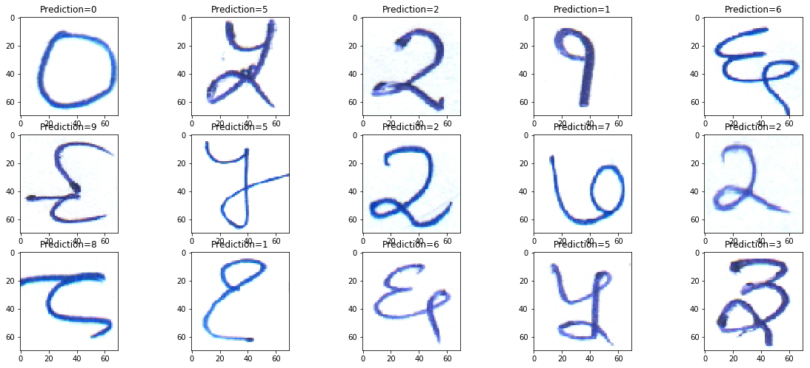

# 1. Introduction
This project involves detection and recognition of handwritten text written in the Devanagari script using Deep Learning techniques. It was taken up as a project work while at Bhabha Atomic Research Center, India in the summer of 2019. Devanagari script is widely used in the Indian subcontinent. It is used for several major languages since ages like Sanskrit, Pali, Hindi, etc. This project deals with text in the Hindi language, to be precise. 

# 2. Dataset
This project is based upon the dataset made available at the [International Conference on Computer Vision & Image Processing 2019](http://cvip2019.mnit.ac.in/) at Malaviya National Institute of Technology, Jaipur.
The dataset contains:
1. Hindi Numerals
2. Hindi Vowels
3. Hindi Consonants
4. Hindi Handwritten Text with separate annotations for each of them.

Sample:
<p align="center">
  
</p>

This dataset was divided into `train`, `test`, and `valid` approximately with 96%, 2%, 2% data from the entire dataset respectively.

## 2. i. Limitations of the dataset
However, the dataset was essentially small with only 50 images of Handwritten Text. Therefore, difficulties were faced while training the model accurately.
Secondly, not all images were consistent and there was some noise in the data too.

# 3. Components
The project can be divided into 3 major sections:
* **Classification of the Hindi numerals using CNN.**
* **Studying the effect of using Transfer Learning on the dataset for classification of numerals.**
* **Word and Line Segmentation using Image Processing Techniques.**
* **Training the Handwritten Text Recognition model anf study the performance on IAM data VS Devanagari(our) data.**

## 3. i. Classification using CNN
Convolution Neural Networks have played a major role in the field of Computer Vision in the last few years. Here, one such CNN has been implemented to classify the numerals of the Devanagari script. The numerals of the Devanagari script looks like:
<p align="center">
  
</p>

The CNN model used is rather a basic network to reduce overfitting (as already mentioned before the dataset is small). 
<p align="center">
  
</p>

The model was trained with the `EarlyStopping` callback and it was observed that the accuracy on the validation dataset stagnates after 5 epochs where it stops further training to avoid overfitting. The outcomes and the code can be seen in the `1.nn_classification/devanagri_cnn.ipynb` file.

The result of the predicted output is as follows:
<p align="center">
  
</p>

## 3. ii. Studying the use of Transfer Learning
To better understand the concepts of Deep Learning, a minor implementation of Transfer Learning was also executed.

### 3. ii. a. Dataset
Observing the Hindi numeral dataset closely, it can be found out that it has got close resemblances with the `Handwritten Digit MNIST` dataset. Since the MNIST dataset is a larger one with different variations,it was used to train the model.
<p align="center">
  
</p>
For testing, the Hindi numeral dataset was used. However, some preprocessing was done on the original numeral dataset so as to make the images look more like the ones in the MNIST dataset.

### 3. ii. b. Transfer Learning
A similar model like the one above was built and trained on the MNIST dataset. After training the model, we "froze" the last couple of layers and again trained it on the Hindi numeral dataset, but as mentioned only the last couple of layers. It helped to achieve 2 things:
* Gain the feature extraction parameters from the model trained on the MNIST dataset.
* The model could now differentiate between the numerals of the Devanagari script instead of the MNSIT dataset. 

Some of the predictions are:
<p align="center">
  
</p>
Note: It can be observed, that all the predicted values in this sample has been correctly identified.

## 3. iii. Word and Line Segmentation
To extract the lines and eventually the words, Image Processing techniques were used. For Line Segmentation, the images were first converted to grayscale. Then several image processing techniques were used like the image was converted to a binary image i.e, all the pixel value was assigned either a  **light** value or a **dark** value depending on a certain fixed threshold. In the resultant image, the pixels with the lower values were dilated. This resulted the words in the same line to be in the same "patch". This was a result of the fact that each line is separated from the other by a distinguishable space in between. From the result, the contours were detected so as to get the ROI boundaries. The code in `3. img_processing/line_segmentation.ipynb` was used.  A sample text segmented into lines:
<p align="center">
  
</p>

For Word Segmentation, the simple [Word Segmentation](https://github.com/githubharald/WordSegmentation) implementation by Harald Scheidl was used. A sample line segmented into words: 
<p align="center">
  
</p>


## 3. iv. Training the Handwritten Text Recognition model.
The implementation of [Handwritten Text Recognition(HTR)](https://github.com/githubharald/SimpleHTR) by Harald was used to study how it performs on both the IAM dataset and the Devanagari dataset respectively. The model in the implementation was built to work on the images of IAM dataset where word images for each of the handwritten text were provided separately. The model was trained for around 20 epochs after which there was no improvement in the validation accuracy, thus training stopped as a similar feature like the `EarlyStopping` callback was used. A Test Accuracy of nearly 65% was achieved. 

A snapshot of the predictions on the IAM dataset:
```
[OK] "board" -> "board"
[OK] "in" -> "in"
[OK] "1958" -> "1958"
[OK] "offered" -> "offered"
[ERR:2] "six" -> "Sir"
[ERR:1] "craft" -> "croft"
[ERR:3] "apprenticeships" -> "spprestsceships"
[OK] "and" -> "and"
[OK] "received" -> "received"
[ERR:2] "450" -> "4so"
[ERR:2] "applications" -> "opplicoations"
[OK] "," -> ","
[OK] "of" -> "of"
[ERR:1] "whom" -> "whow"
[ERR:2] "100" -> "1s"
[OK] "were" -> "were"
Character error rate: 12.855210%. Word accuracy: 65.909091%.
```
</br>

However for the Devanagari dataset, no such separate word images were available. Therefore, the Word Segmentation implementation played an important role in segmenting the words separately in each of the images of the forms. Each of the words were separated for ~50 forms. The ground truth values were also extracted in a format similar to the IAM ground truths. This was fed to the model. After around 40 epochs, the training stopped. However, initially, it was found, that the model was performing very poorly with around 14% accuracy.
```
[OK] "के" -> "के"
[ERR:4] "बीच" -> "दोएम"
[ERR:5] "बहुपक्षीय" -> "पर्रीय"
[ERR:4] "संबंधों" -> "सं्वधिी"
[OK] "का" -> "का"
[ERR:2] "युग" -> "दुा"
[ERR:3] "है।" -> "पूई"
[ERR:5] "राज्यों" -> "ाा्ी"
[OK] "के" -> "के"
[ERR:3] "इन" -> "दू्"
[ERR:6] "बहुपक्षीय" -> "अा्ा्धीय"
[ERR:5] "संबंधों" -> "अंसेमरों"
[OK] "के" -> "के"
[ERR:5] "संचालन" -> "अधपन"
Character error rate: 76.245211%. Word accuracy: 8.000000%.
```
Then, to increase the number of training examples, Data Augmentation was used - rotating the image by 5, 10, 340, 350 degrees and also a morphological operation (erosion) was implemented. Thus, it resulted in 6 images per word which increased the number of words from around 1500 to around 9000.</br>
Sample:
<p align="center">
  
</p>

The annoatation file was also prepared accordingly.
This data was fed to the model and it turned out the validation accuracy jumped to ~70%. More than the accuracy, the thing to be noticed is the reduction in the Character recognition error rate.
That's the power of Data! (Mic drop.)

Here are some results:
```
[OK] "आदि" -> "आदि"
[OK] "आदि" -> "आदि"
[OK] "आदि" -> "आदि"
[OK] "आदि" -> "आदि"
[OK] "आदि" -> "आदि"
[ERR:6] "क्षे़त्रों" -> "बंत़रों"
[ERR:1] "क्षे़त्रों" -> "क्षे़्रों"
[ERR:4] "क्षे़त्रों" -> "कोषसन्रों"
[ERR:8] "क्षे़त्रों" -> "बोनों"
[OK] "क्षे़त्रों" -> "क्षे़त्रों"
[OK] "में" -> "में"
[OK] "में" -> "में"
[OK] "में" -> "में"
[OK] "में" -> "में"
[OK] "में" -> "में"
[OK] "सहयोग" -> "सहयोग"
[OK] "सहयोग" -> "सहयोग"
[OK] "सहयोग" -> "सहयोग"
[OK] "सहयोग" -> "सहयोग"
[OK] "सहयोग" -> "सहयोग"
[OK] "के" -> "के"
Character error rate: 11.254019%. Word accuracy: 72.666667%.
```
# 4. Future Work
Since the current model performed only fairly well and more generalisation is possible, this project can be given shape in two ways:
* Preprocess the images - Use Image Processing techniques to preprocess the images more accurately and make it look more like the ones in the IAM dataset. However, a great deal of improvement may not be observed since the model was doing only fairly well with a ~65% accuracy on the IAM dataset itself for which it was designed.
* Use other Deep Learning approaches - Another approach that could be tried is Character Level Classification. This would be a challenging task since each of the words would be required to be broken down into separate characters for training on a CNN model. 

# 5. Conclusion
As the ending remarks, it should be noted that this dataset is rather very small to train a Deep Learning model. It can clearly be observed that such a small dataset is definitely not the way to go for a robust Deep Learning model. There are high chances that the model will not be able to generalise well. More use of techniques like Data Augmentation can be used, however, that would not increase the dataset to a huge extent (not even close to 10^5 - 10^6, which is considered preferable for training any Deep Learning model). On a lighter note, therefore, a hunt for a newer and better dataset involving the Devanagari characters has just begun!
